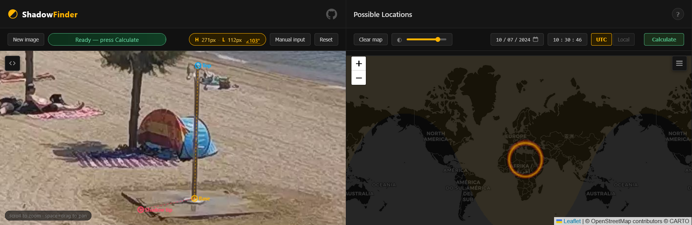
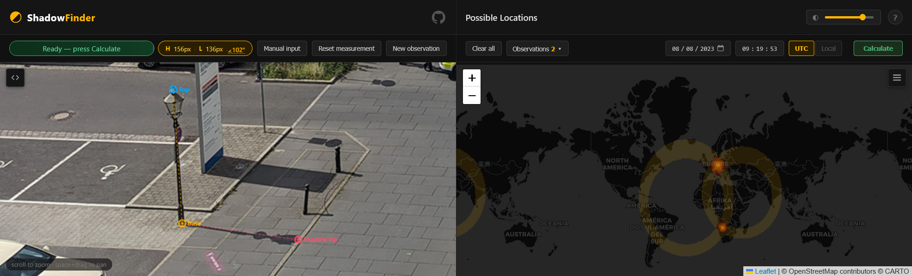

<h1> ShadowFinder <code>Web</code></h1>

**Geolocate a photo by the length of a shadow, entirely in your browser.**

`ShadowFinder Web` is a browser-based port of Bellingcat's [**ShadowFinder**](https://github.com/bellingcat/ShadowFinder). From an object, its shadow, and the date and time, it maps **every place on Earth** where that shadow could fall. No setup, accounts, Jupyter or Colab. Drop an image, mark three points, pick a time, hit calculate. No uploads. No server. Everything runs locally in your browser.

**[Try it live → kluter.github.io/ShadowFinder-Web](https://kluter.github.io/ShadowFinder-Web/)**



---

## Standing on the shoulders of Bellingcat

This project would not exist without the original [ShadowFinder](https://github.com/bellingcat/ShadowFinder), created by [**Galen Reich**](https://github.com/GalenReich) at Bellingcat, with contributors **Jordan Gillard**, **Thomas Ellmenreich** and **Boris Nezlobin**. They did the hard part. `ShadowFinder Web` is a faithful re-implementation of their algorithm in JS.

If you use this tool in research, cite the original project. 

---

## Why port it?

The original is brilliant, but getting a result takes work: 
A Google sign-in for Colab, measuring shadow pixels in a *separate* tool, and pasting numbers into code cells. `ShadowFinder Web` removes those steps and wraps the method in a clean, guided interface.

---

## What it adds over the notebook

| Aspect | Original notebook | `ShadowFinder Web` |
|---|---|---|
| **Measuring** | a separate image tool, then paste numbers | click base, top and shadow tip on the image |
| **Running it** | edit and run code cells | a guided five-step interface |
| **Date and time** | type it in | type it in, or autofill from `EXIF` if present |
| **Bad geometry** | no warning | live shadow-angle warning (experimental) |
| **Result** | a static `PNG` | an interactive map (Dark, OpenStreetMap, Satellite) |
| **Combining shots** | one shadow, one band | overlap several timed shots of the same place to pin it |
| **To start** | Colab and a Google sign-in | open a web page |

---

## The key requirement

> **Shadow length is only accurate when the camera is side-on to the shadow** (it runs left to right across the frame, about 90 degrees to the object). Point it toward or away from the camera and perspective distorts the shadow's apparent length, skewing the height-to-shadow-length ratio the tool depends on, so the band lands in the wrong place. The tool measures this angle and warns you.

The tool grades the object-to-shadow angle like this:

| Angle, object to shadow | Verdict |
|---|---|
| `88° to 98°` | 🟢 good, reliable |
| `85° to 87°`, or `99° to 109°` | 🟡 borderline, usable |
| `< 85°` or `> 109°` | 🔴 likely wrong |

These thresholds are experimental, set by feel rather than rigorous testing. Contributions to refine them are welcome.

---

## How to use

1. **Drop a photo** on the left panel (or click *Browse*).
2. **Mark three points:** the base of the object, its top, then the shadow tip.
3. **Set the date and time** (or click *Use this `date & time`* from `EXIF`). Pick **UTC** or **Local**.
4. **Calculate.** The bright band shows every location where that shadow could occur.

---

## Reading the result

The band is **every place the shadow could fall**, a search space, not a pin.

- **Brightest is the best match**, fading out toward the 20% edge.
- Expect a long curved band (often two), not a dot; a tighter band means better input.
- It only rules places out. Combine it with terrain, climate, and other clues to narrow down.
- Got the same place at another time? Add it as a new observation; where the bands overlap narrows to a spot (two for a fix, a third to disambiguate).

---

## How it works

- Sun positions come from [SunCalc](https://github.com/mourner/suncalc), the JS equivalent of the original's `suncalc` package.
- The world is sampled on a `0.5 degree grid` (latitude -60 to 85). Each point's sun altitude gives the expected shadow ratio `height / tan(altitude)`, compared to yours.
- Points within a **20% band** are drawn, brightest where the match is exact, the same band the original produces.
- **Local mode** uses Bellingcat's `timezone_grid.json` to convert your local time to UTC at every point before computing the sun.

Checked against the [Original](https://github.com/bellingcat/ShadowFinder): `height 10`, `shadow 8`, `2024-02-29 12:00 UTC` reproduces the ring from its README.

The one deliberate difference is the projection: the original is a static equirectangular plot, while `ShadowFinder Web` uses an interactive **Web Mercator** map you can zoom into. Same band, same data, just curved more toward the poles. A flat layout would mean dropping Leaflet's tiles, which are Web Mercator only.

For the full method and worked examples, see [Bellingcat's article](https://www.bellingcat.com/resources/2024/08/22/shadow-geolocate-geolocation-locate-image-tool-open-source-bellingcat-measure/).

---

## Try it yourself

#### Three single-shadow cases with known answers:

| Test | Date and time | Expected |
|------|---------------|----------|
| Manual Input: `Height 10`, `Shadow 8` | `2024-02-29 12:00:00 UTC` | The ring from the original's [README](https://github.com/bellingcat/ShadowFinder) |
| A [Sunny Seaside Image](https://www.bellingcat.com/app/uploads/2024/08/image10.jpg) | `2024-07-10 10:30:46 UTC` | Bellingcat's [Result Map](https://www.bellingcat.com/app/uploads/2024/08/ShadowTool.png) |
| A [still](assets/05_03_2024_111741_shadow_test_rainbolt.png) from this [Rainbolt Video](https://www.youtube.com/watch?v=pQIjDPFgdJA) | `2024-05-03 11:17:41 Local` | The [result](assets/result_shadow_test_rainbolt.png) revealed in the video |

Mind the Rainbolt date format: the video writes it `05 03 2024`, month-first, so that is 3 May, not 5 March. Enter the wrong one and the band lands in the wrong place.

#### Cross two shadows into an intersection

One shadow gives a band that wraps the globe. Measure the **same place** at two different times and the bands cross, narrowing it toward a single spot. Two demo frames of one location, each carrying its capture time in `EXIF` (already in `UTC`):

| Observation | Date and time | Time source |
|---|---|---|
| [Frame 1](assets/DEMO_20230808_091953195.jpg) | `2023-08-08 09:19:53 UTC` | baked into the file's `EXIF`, hit *use this date & time* |
| [Frame 2](assets/DEMO_20240414_134449138.jpg) | `2024-04-14 13:44:49 UTC` | baked into the file's `EXIF`, hit *use this date & time* |

Load the first frame, mark its shadow and calculate. Then click **New observation**, load the second, and calculate again. The bright zone where the two bands overlap is the answer:



---

## Run it locally

A static site, no build step. Serve the folder with anything:

```bash
# any static server works, for example
npx serve .
# or VS Code's Live Server extension
```

---

## Security & Privacy

Your photo never leaves your browser. It is drawn into a canvas and its EXIF is read in memory, no upload, no server. Confirm it yourself: open DevTools (`F12`) → Network, load an image, and no request carries it. Any EXIF text is escaped before it is shown, so a crafted file cannot inject anything.

The only outbound requests are map tiles (CARTO, OpenStreetMap, Esri) and the Leaflet library. The only thing stored is your chosen map layer, in `localStorage` (`sf-tileset`), no image data, no coordinates.

```javascript
// Every network request ShadowFinder Web makes:
// GET unpkg.com/leaflet@1.9.4/...   (the map library, once)
// GET .../tile/{z}/{x}/{y}          (map tiles)
// GET timezone_grid.json            (local file, Local mode only)
// No image, no coordinates, nothing else.
```

### Code and dependencies

`ShadowFinder Web` is plain HTML, CSS, and JavaScript with no build step. Its logic lives in `js/script.js`, unminified, so what you read is what runs.

| Library | Loaded from | Touches your data? |
|---|---|---|
| [Leaflet](https://leafletjs.com/) | CDN (unpkg) | No, renders map tiles only |
| [SunCalc](https://github.com/mourner/suncalc) | bundled in `js/` | Locally only, no network |
| [exifr](https://github.com/MikeKovarik/exifr) | bundled in `js/` | Locally only, no network |

Only Leaflet comes from a CDN; swap it for a local copy to run fully offline.

It was built with AI assistance, disclosed on purpose because the [risks of opaque, AI-generated OSINT tools](https://www.dutchosintguy.com/post/vibe-coding-is-becoming-an-osint-risk) are real. The fix is not to hide it, but to keep the code readable so anyone can verify it.

### Security caveats

- **Map tiles reveal the area you view.** Tile requests encode the map coordinates, so a tile server can infer where you are looking. Use a VPN if that matters.
- **One CDN dependency.** Leaflet loads from unpkg. A compromised CDN could in theory serve malicious code, but this is highly unlikely; self-host Leaflet to rule it out entirely.
- **Browser and OS trust.** If your browser or system is compromised, no web app can protect you.

---

## Related

You may also like  **[TracePoint](https://github.com/kluter/TracePoint)**, my other browser geolocation tool. It finds where a photo was taken by intersecting lines of sight.
