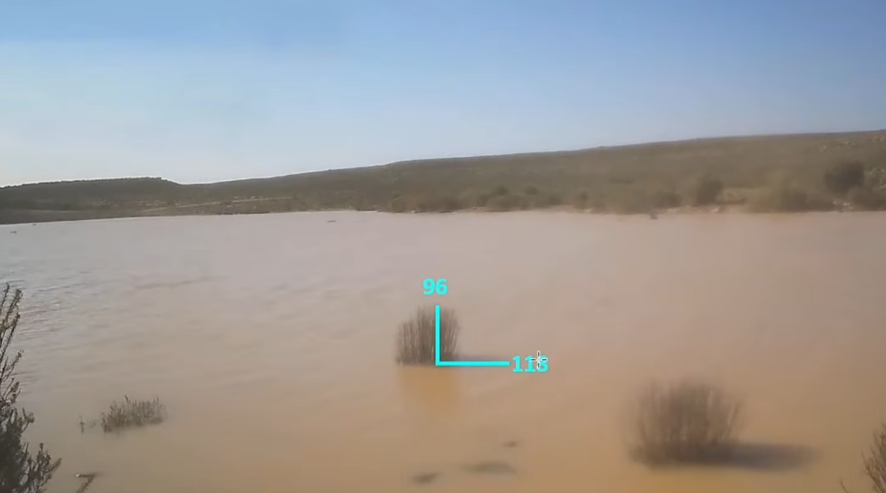
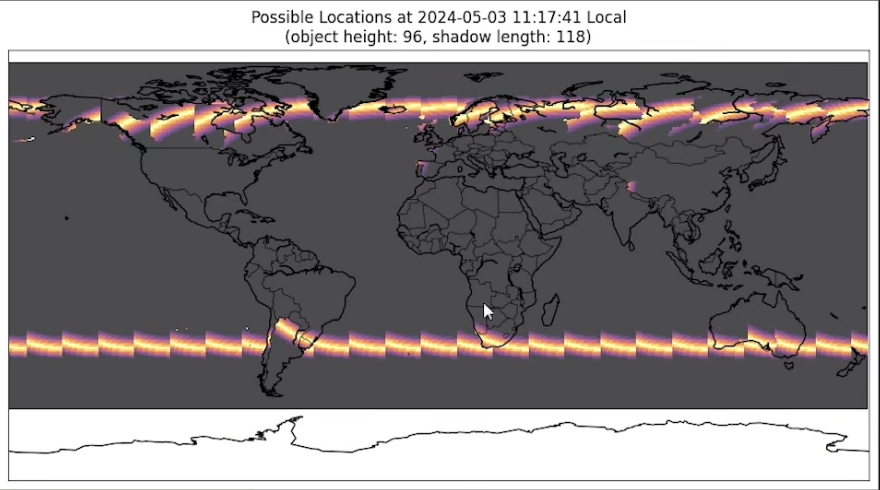

<div align="center">
  <h1> ShadowFinder&nbsp;Web</h1>
  <p><em>Geolocate a photo by the length of a shadow, entirely in your browser.</em></p>
</div>

ShadowFinder Web is a browser-based port of Bellingcat's [**ShadowFinder**](https://github.com/bellingcat/ShadowFinder). Give it an object, the length of its shadow, and the date and time of the photo. It maps **every place on Earth** where that shadow could fall at that moment, the bright band ShadowFinder users know.

No setup or accounts, nor Jupyter or Colab. Drop an image, click three points, pick a time, hit calculate. It all runs in your browser, and your photo never leaves your device.

<"PLACEHOLDER DEMO IMG / GIF">

## Standing on the shoulders of Bellingcat

This project would not exist without the original [ShadowFinder](https://github.com/bellingcat/ShadowFinder), created by **Galen Reich** at Bellingcat, with contributors **Jordan Gillard**, **Thomas Ellmenreich** and **Boris Nezlobin**. They did the hard part: the science, the solar maths, and the pre-computed timezone grid. ShadowFinder Web is a faithful re-implementation of their algorithm in JS.

If you use this tool in research, cite the original project. Their write-up, [*Chasing Shadows*](https://www.bellingcat.com/resources/2024/06/24/shadowfinder-tool-geolocation-shadow/), is the best way to understand the method.

## Why port it?

The original is brilliant, but getting a result takes work: a Google sign-in for Colab, measuring shadow pixels in a *separate* tool, and pasting numbers into code cells. Fine for analysts, out of reach for many casual investigators.

ShadowFinder Web removes those steps and wraps the method in a clean, guided interface. Same maths, one drag and drop away.

## What it adds over the notebook

|  | Original notebook | ShadowFinder Web |
|---|---|---|
| **Measuring** | a separate image tool, then paste numbers | click base, top and shadow tip on the image |
| **Running it** | edit and run code cells | a guided five-step interface |
| **Date and time** | type it in | reads EXIF, one click fills the fields |
| **Bad geometry** | no warning | live shadow-angle check |
| **Result** | a static PNG | an interactive map (Dark, OpenStreetMap, Satellite) |
| **To start** | Colab and a Google sign-in | open a web page |

## The one thing you must know

> **Shadow length is only accurate when the camera is side-on to the shadow** (it runs left to right across the frame, about 90 degrees to the object). Point it toward or away from the camera and it looks foreshortened, measures too short, and the result is off. The tool shows this angle and warns you.

The tool grades the object-to-shadow angle like this:

| Angle, object to shadow | Verdict |
|---|---|
| 88 to 98 degrees | good, reliable |
| 85 to 87, or 99 to 109 | borderline, usable |
| under 85 or over 109 | likely wrong |

These thresholds are more of a gut feeling from very little testing, and can use some refinement.

## How to use

1. **Drop a photo** on the left panel (or click *Browse*).
2. **Mark three points:** the base of the object, its top, then the shadow tip.
3. **Set the date and time** (or click *Use this date & time* from EXIF). Pick **UTC** or **Local**.
4. **Calculate.** The bright band shows every location where that shadow could occur.

## How it works

- Sun positions come from [SunCalc](https://github.com/mourner/suncalc), the JS equivalent of the original's `suncalc` package.
- The world is sampled on a **0.5 degree grid** (latitude -60 to 85). Each point's sun altitude gives the expected shadow ratio `height / tan(altitude)`, compared to yours.
- Points within a **20% band** are drawn, brightest where the match is exact, the same band the original produces.
- **Local mode** uses Bellingcat's `timezone_grid.json` to convert your local time to UTC at every point before computing the sun.

Checked against the [original](https://github.com/bellingcat/ShadowFinder): height **10**, shadow **8**, `2024-02-29 12:00 UTC` reproduces the ring from its README.

The one deliberate difference is the projection. The original is a static equirectangular plot; ShadowFinder Web uses an interactive **Web Mercator** map so you can zoom into satellite imagery to confirm a location. Same band, same data, just drawn on a slippy map, so it curves more toward the poles than the original's flat stripes. Matching that flat layout would mean dropping Leaflet's tiled basemaps, which are Web Mercator only.

## Try it yourself

Three cases with known answers:

| Test | Load | Date and time | Expected |
|------|------|---------------|----------|
| Numeric reference | **Manual input**: height `10`, shadow `8` | `2024-02-29 12:00:00 UTC` | the ring from the [original's README](https://github.com/bellingcat/ShadowFinder) |
| Bellingcat sample | [image10.jpg](https://www.bellingcat.com/app/uploads/2024/08/image10.jpg) | `2024-07-10 10:30:46 UTC` | Bellingcat's [result map](https://www.bellingcat.com/app/uploads/2024/08/ShadowTool.png) |
| Real photo | a still from [this Rainbolt video](https://www.youtube.com/watch?v=pQIjDPFgdJA) | `2024-05-03 11:17:41` local | the location revealed in the video (below) |

Mind the Rainbolt date format: the video writes it `05 03 2024`, month-first, so that is 3 May, not 5 March. Enter the wrong one and the band lands in the wrong place.

<p align="center">
  
  &nbsp;
  
</p>

## Run it locally

A static site, no build step. Serve the folder with anything:

```bash
# any static server works, for example
npx serve .
# or VS Code's Live Server extension
```

## Privacy & Transparency

Your photo never leaves your browser. It is drawn into a canvas and its EXIF is read in memory, with no upload and no server behind the tool. The only outbound requests are map tiles from public servers (CARTO, OpenStreetMap, Esri) and the Leaflet map library from a CDN. The only thing saved is your chosen map layer, in `localStorage`.

One caveat: map tile requests encode the area you are viewing, so a tile server can infer where you are looking. Use a VPN if that matters.

ShadowFinder Web is plain HTML, CSS, and JavaScript with no build step. Its own logic lives in `js/script.js`, unminified, so what you read in the repo is what runs in your browser. (The third-party libraries, Leaflet, SunCalc and exifr, are their standard builds.)

It was built with AI assistance. That is disclosed on purpose, because the [risks of opaque, AI-generated OSINT tools](https://www.dutchosintguy.com/post/vibe-coding-is-becoming-an-osint-risk) are real. The answer is not to hide the involvement, but to keep the code readable so anyone can verify what it does.

## Related

You may also like **[TracePoint](https://github.com/kluter/TracePoint)**, a sibling browser tool for geolocation by line-of-sight intersection, with the same dark, no-friction design.
